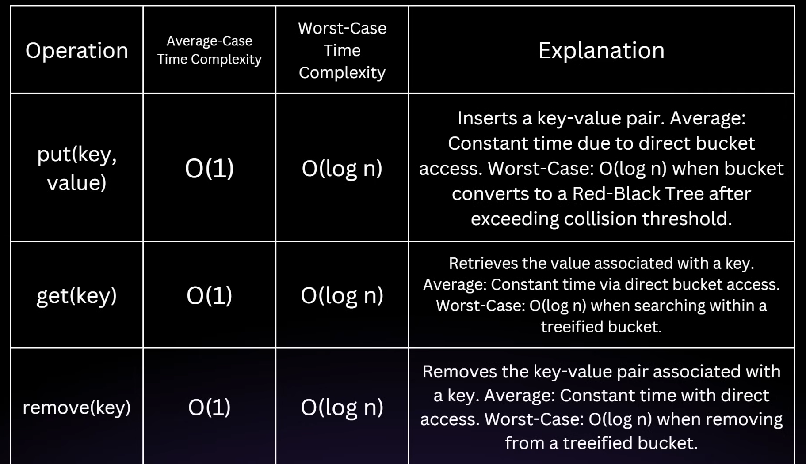

`<>` -> This symbol in java is called Diamond Operator

# A collection represent object that is group of objects, knows as elements.

        key Interfaces in collection Frameworks are :- 
         1.  Collection Interface - The root Interface for all collection type.
         2.  List - An ordered Collection that contains duplicates elements ( eg ArrayList, LinkedList ).
         3.  Set - A collection that cannot contain duplicate elements (e.g., HashSet, TreeSet).
         4.  Queue - A collection designed for holding elements prior to processing (e.g., PriorityQueue, LinkedList        when used as a queue).
         5.  Deque - A double-ended queue that allows insertion and removal from both ends (e.g., ArrayDeque).
         6.  Map - An interface that represents a collection of key-value pairs (e.g., HashMap, TreeMap).

**Collection Framework Hirerchy**

    Since Collection is an Interface, it cannot be intentiatiated directly; rather, it provides blueprint  of basic opearations that are common to all the Collections. 

    The collection are set of core method that are implemented by all classes that implements the interface. This methods allow the basic operation such as adding, removing, and checking the existence of element in collection.

    It is a part of `java.util` package

 
 1. iterable -  
 A class that extends the Iterable interface in Java gains the capability to be used in a "for-each" loop (enhanced for loop). This is achieved through the iterator() method, which the class must implement. The iterator() method returns an Iterator object, which is then used to traverse the elements of the collection.

        Specifically, a class implementing Iterable must provide the following:

        1. iterator() method: This method returns an Iterator instance. The Iterator is responsible for providing access to the elements of the collection one by one.

        2. hasNext() method (in Iterator): Determines if there are more elements to iterate over.

        3. next() method (in Iterator): Returns the next element in the iteration.

        4. remove() method (in Iterator, optional): Removes the last element returned by next() from the collection.

2. List -  
The List `interface` in Java is a part of the `java.util` package and is a sub-interface of the `Collection` interface. It provides a way to store an `ordered collection of elements` (known as a sequence). Lists allow for precise control over where elements are inserted and can contain duplicate elements.

        The List interface is implemented by several classes in the Java Collection Framework, such as ArrayList, LinkedList, Vector, and Stack.

        Key Features of the List Interface are :-
            1. Order Preservation
            2. Index Based Access
            3. Allow Duplicates Elements
    
    Concrete Classes of List Interfaces :- 
    
    1. ArrayList:-  
        An ArrayList is a resizable collection of Implementation of List Interface. Unlike arrays in java, which has fixed size, an `array List can change its size dynamically` as elements are added or removed. This flexibility makes it popular choice when number of element isn't known in advance.

        * when we create an ArrayList it has an initial capacity (default 10). The capacity refers to the size of the internal array that can hold the element before needing to resize.

                When we add an element to an ArrayList, the following steps occur :-

                    Check Capacity: Before adding the new element, ArrayList checks if there is enough space in the internal array (elementData). If the array is full, it  needs to be resized.

                    Resize if Necessary: If the internal array is full, the ArrayList will create a new array with a larger capacity (usually 1.5 times the current     capacity) and copy the elements from the old array to the new array.

                    Add the Element: The new element is then added to the internal array at the appropriate index, and the size is incremented.

                Resizing the Array:-

                    Initial Capacity: By default, the initial capacity is 10. This means the internal array can hold 10 elements before it needs to grow.

                    Growth Factor: When the internal array is full, a new array is created with a size 1.5 times the old array. This growth factor balances memory efficiency and resizing cost.

                    Copying Elements: When resizing occurs, all elements from the old array are copied to the new array, which is an O(n) operation, where n is the number of elements in the ArrayList.

                Removing Element :-

                    Check Bounds: The ArrayList first checks if the index is within the valid range.

                    Remove the Element: The element is removed, and all elements to the right of the removed element are shifted one position to the left to fill the gap.

                    Reduce Size: The size is decremented by 1.

            1. List.of(...element) - creates a Immutable list which don't support list updtion and deletion.

            2. Arrays.asList(..element) - Only supports List updation not deletions.

            3. Converting List to array -

                    List<Integer> list = new ArrayList<>();

                    // If we don't pass new Integer[0] it will create a array of type Object[]
                    Integer[] array = list.toArray(new Integer[0]);

            4. Sorting of List - 

                    Collection.sort(Comperator<? super T> comp)
                    methods take comperator Object and based on the compare(Object o1, Object o2) decides how the list sorting is done.

                    If the value is -ve then ordering of all the Element is same as they appear in the function i.e. o1 comes before o2.
                    If the value is 0 then ordering would be the same.
                    If the value is +ve then o2 comes before o1.

                    Implementation - 

                    class StringLengthComperator implements Comparator<String> {

                        @Override
                        public int compare(String o1, String o2) {

                            return o1.length() - o2.length();
                        }

                    }

                    public class Main {

                        public static void main(String[] args) {

                            List<String> words = List.of("banana", "apple", "date");

                            words.sort(new StringLengthComperator);

                        }

                    }

    2. LinkedList ( We can Use this Linked List when we have write Intensive Opearation ):-

        

        performance Considerations -

            Linked List has different performance characterstics compaed the array -

                1. Insertion and Deletion - 
                    LikedList is better for frequent insertion and deletion in the middle as the list because it doesn't require shifting of element, as in the array List

                2. Random Access -
                    LikedList has slower Random Access as Compared to the ArrayList as it has to traverse the array from beginning to the index to get the desired index.

                3. Memory Overhead -
                    Linked List require more memory then ArrayList because each Node requires extra memory to store refrence to the next and previous node.

    3. Vector:-

        A Vector in Java is a part of the java.util package and is one of the legacy
        classes in Java that implements the List interface.

        It was introduced in JDK 1.0 before collection framework and is synchronized, making it thread-safe.
        Now it is a part of collection framework.

        However, due to its synchronization overhead, it's generally recommended to use other modern alternatives like ArrayList in single-threaded scenarios.
        Despite this, Vector is still useful in certain situations, particularly in multi-threaded environments where thread safety is a concern.

            Key Features of Vector - 

            Dynamic Array: Like ArrayList, Vector is a dynamic array that grows automatically when more elements are added than its current capacity.

            Synchronized: All the methods in Vector are synchronized, which makes it thread-safe.
            This means multiple threads can work on a Vector without the risk of corrupting the data. However, this can introduce performance overhead in single-threaded environments.
 
            Legacy Class: Vector was part of Java's original release and is considered a legacy class. It's generally recommended to use ArrayList in single-threaded environments due to performance considerations.

            Resizing Mechanism: When the current capacity of the vector is exceeded, it doubles its size by default (or increases by a specific capacity increment if provided).

            Random Access: Similar to arrays and ArrayList, Vector allows random access to elements, making it efficient for accessing elements using an index.

            Constructors of Vectors - 

            1. Vector(): Creates a vector with an initial capacity of 1O.
            2. Vector(int initialCapacity): Creates a vector with a specified initial capacity.
            3. Vector(int initialCapacity, int capacityIncrement): Creates a vector with an initial capacity and capacity incremen (how much the vector should grow when its capacity is exceeded).
            4. Vector(Collection<? extends E> c): Creates a vector containing the elements of the specified collection.

            Methods of vector - 

            1. add(E e): Adds an element at the end.
            2. add(int index, E element): Inserts an element at the specified index.
            3. get(int index): Retrieves the element at the specified index.
            4. set(int index, E element): Replaces the element at the specified index.
            5. remove(Object o): Removes the first occurrence of the specified element.
            6. remove(int index): Removes the element at the specified index.
            7. size(): Returns the number of elements in the vector.
            8. isEmpty(): Checks if the vector is empty.
            9. contains(Object o): Checks if the vector contains the specified element.
            10. clear(): Removes all elements from the vector.

            Synchronization and Performance

            Since Vector methods are synchronized, it ensures that only one thread can access the vector at a time. 
            This makes it thread-safe but can introduce performance overhead in single-threaded environments because synchronization adds locking and unlocking costs.
            In modern Java applications, ArrayList is generally preferred over Vector when synchronization isn't required. 
            For thread-safe collections, the CopyOnWriteArrayList or ConcurrentHashMap from the java.util.concurrent package is often recommended instead.

    4. Stack:-

        Stack is an extension of vector class. Ultimately it's a thread safe class.

        LIFO( Last In First Out ) - stacks follows the `last In first out`, where the last element added is the first one to be removed.

        Inheritance - Since Stack is a Sub class of vector, which means it inherits all the features of a dynamic array but it constrained by the Stack's LIFO nature.

    5. CopyOnWriteArrayList ( We can use this List when we have read Intensive Operation as Writing in this arrays is expensive and memory Intensive Operation on top of that it provides thread saftey ):-

        CopyOnWriteArrayList means whenever any Write Operation ( like insert, delete ) is performed on the Array, these operation is perfomed over the new Copy of Array without disturbing the original array so that any thread which is trying to read the original array is not Locked for the given period.

        Read Operation:- Fast and direct, since they happen on the stable list without interferance from modification.
        Write Operation:- A new Copy of List is created from any modifications, then reference of new list is updated so that the subsequent read perfomed over the new List.

---

## Comparable & Comperator

Comparable and Comparator in Java lies in how they handle sorting: Comparable provides a single natural ordering, while Comparator allows for multiple custom sorting criteria. Comparable is implemented directly within the class being sorted, whereas Comparator is an external class that defines the comparison logic

    Comparable:
        Implements the compareTo() method, which is part of the Comparable interface.
        Provides a natural ordering for the class, meaning it defines how objects of that class should be sorted in a default way.
        For example, if you want to sort a list of String objects, String implements Comparable, and the natural ordering is based on the lexicographical order of the  strings.

    Comparator:
        Implements the compare() method, which is part of the Comparator interface.
        Allows for multiple sorting orders, meaning you can sort objects based on different criteria.
        Example: You might have a Student class and want to sort students by age, then by GPA, then by name. Each sorting criterion would require a separate Comparator  implementation.

    Key Differences:
        Comparable is built into the class, while Comparator is an external class.
        Comparable provides a single natural order, while Comparator provides multiple custom orders.
        Comparable is useful when a class has a natural ordering that is generally acceptable, whereas Comparator is more flexible when different sorting rules are needed. 

    

    Comperator Implementation - 

        students.sort((o1, o2) -> {
            if ( o2.getGpa() - o1.getGpa() > 0)
                return 1;
            else if ( o2.getGpa() - o1.getGpa() < 0 )
                return -1;
            
            return 0;
        });

        using Java 8 Implementation -  

        Comparator<Student> comparator = Comparator.comparing(Student::getGpa).reversed().thenComparing(Student::getName);
        students.sort(comperator)

    
    Comperable Implementation

        public class Student implements Comparable<Student> {
        
            private String name;
            private double gpa;

            public Student(String name, double gpa) {
                this.name = name;
                this.gpa = gpa;
            }

            public String getName() {
                return name;
            }
            public void setName(String name) {
                this.name = name;
            }
            public double getGpa() {
                return gpa;
            }
            public void setGpa(double gpa) {
                this.gpa = gpa;
            }

            @Override
            public int hashCode() {
                final int prime = 31;
                int result = 1;
                result = prime * result + ((name == null) ? 0 : name.hashCode());
                long temp;
                temp = Double.doubleToLongBits(gpa);
                result = prime * result + (int) (temp ^ (temp >>> 32));
                return result;
            }

            @Override
            public boolean equals(Object obj) {
                if (this == obj)
                    return true;
                if (obj == null)
                    return false;
                if (getClass() != obj.getClass())
                    return false;
                Student other = (Student) obj;
                if (name == null) {
                    if (other.name != null)
                        return false;
                } else if (!name.equals(other.name))
                    return false;
                if (Double.doubleToLongBits(gpa) != Double.doubleToLongBits(other.gpa))
                    return false;
                return true;
            }

            @Override
            public String toString() {
                return "Student [name=" + name + ", gpa=" + gpa + "]";
            }

            @Override
            public int compareTo(Student o) { //  Natural Ordering
                int result = Double.compare(o.getGpa(), this.getGpa());

                if ( result != 0)
                    return result;

                return this.getName().compareTo(o.getName());
            }
        }

---

## Map Hirerchy

Unordered:  

Does not maintain any order of its elements.
Allows null Keys and Values: Can have one null key and multiple null values.
Not Synchronized: Not thread-safe; requires external synchronization if used in a multi-threaded context.

Performance:  
Offers constant-time performance (0(1)) for basic operations like get and put, assuming the hash function disperses elements properly.

        Basics Components Of HashMap ( Internal Structure Of Hash Map ) -

            1. key - The Identifier is Used to retrive the value.
            2. value - The data associaated with the key.
            3. Bucket - The Place Where Key Vale pair are stored ( Think of Bucket as a cell in the ListArray)
            4. HashFunction - Converts a key into an Index (bucket location) for storage.
                    A HashFunction is an algorithm that takes an input ( or key ) and return a fixed-size bytes of string, typically a numerical Value. The Output is simply known as hash code, hash value or simply hash.
                    The primary Purpose of Hash Function is to map data of Arbitary size to data of fixed size.

        How data is stored in hash Function - 

            Step 1 - Hashing the key
                First, the key is passed through a Unique HashFunction which generated a Unique hash code ( an Integer Number ) This hash code determine where the key-value pair will be stored in the array ( called Bucket Array ).

            step 2 - Calculating the Index
                The Hash Code is Used to calculate an Index in the array using
                    index = hashcode % array_size

            step 3 - Storing in the bucket
                The key-value pair is stored in the bucket at the calculated index. Each bucket can Hold multiple key value pair.
                ( this is called collision handling technique )

        When we call get(key), the HashMap follows these steps:

            Hashing the Key: Similar to insertion, the key is hashed using the same hash function to calculate its hash code.

            Finding the Index: The hash code is used to find the index of the bucket where the key-value pair is stored.

            Searching in the Bucket: Once the correct bucket is found, it checks for the

            key in that bucket. If it finds the key, it returns the associated value.

        Handling Collision - 

            Since different keys can generate the same index (called a collision), HashMap uses a technique to handle this situation. Java's HashMap uses Linked Lists (or balanced trees after Java 8) for this. ( it's also Known as closed addressing technique).

            Two technique of Handling Collision -
                1. Closed Addressing Technique ( also Known as chaining ) - Stores Value in nodes.
                        The data is stores in the the form of Nodes and evantually it form a Linked list or red-black Tree ( self balancing binary search tree ).
                        After java 8 Red-Black Trees are used to stores data.
                2. Open Addressing Technique
                    Two type of Open Addressing Technique
                    1. Linear Probing  
                        Incresing the hash code by 1
                        e.g. index = (old_hash + 1) % array_size
                    2. Quadratic Probing

        HashMap Resizing (Rehashing)

            HashMap has an internal array size, which by default is 16.
            When the number of elements (key-value pairs) grows and exceeds a certain load factor (default is 0.75), HashMap automatically resizes the array to hold more data. This process is called rehashing. The default size of the array is 16, so when more than 12 elements (16 * 0.75) are inserted, the HashMap will resize.

        Time Complexity

            HashMap provides constant time 0(1) performance for basic operations like put() and get() (assuming no collisions).
            However, if there are many collisions, and many entries are stored in the same bucket, the performance can degrade to O(n),
            where n is the number of elements in that bucket. But after Java 8, if there are too many elements in a bucket, HashMap switches to a balanced tree instead of a linked list to ensure better performance O(log n).

LinkedHashMap-  

    It preserves the order In way the element is inserted in the HashMap( It extends the implementation of HashMap and Preserves the Order of the element ).
    By default it uses the load factor 0f 0.75 and it also sort the order of accessing the element i.e, It put the least access element on the top( the main application and reason behind is we can remove the element, which are not frequently accessed ).

    Implementation -

    LinkedHashMap<String, Integer> linkedHashMap = new LinkedHashMap<>(initialCapacity: 20, loadfactor: 0.75, accessOder: true);

        if the accessmode is true, then it sort the elemet in the least access element by default the value of accessOrder is false.
        it can be used as an LRU(Least Recently used) cache.

IdentityHashMap - 

    Identity HashMap works with Identity Hash Code toStore Information in the HashMap hear memory Address are compared over
    hashCode() function i.e, == operator is used to compare the object over the .equals() function.

    == operator compare the memory refrence of the object while .equals() compare the actual value over the memory.

SortedMap - 

SortedMap is an interface that extends Map and guarantees that the entries are sorted based on the keys, either in their natural ordering or by a specified Comparator.

---

