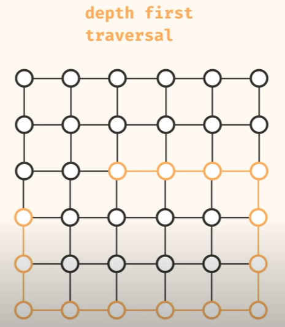
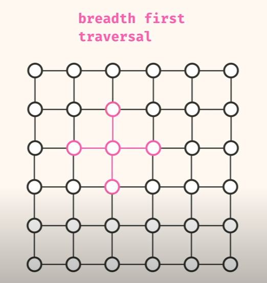

## Depth First Traversal ( Go as deep as we can in one ddirection - pick a neighbour and go in that direction until it becomes Null )

    To traverse into Depth First Traversal, The stack data structures is used.

## Breadth First Traversal ( Explore all the imediate neighbour and keep applying that behaviour other nodes neighbour )

