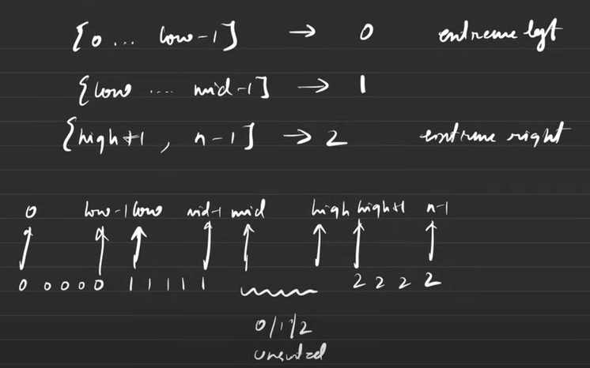

## Dutch National Flag [▶️YouTube🔴](https://www.youtube.com/watch?v=tp8JIuCXBaU&ab_channel=takeUforward)

    dutch National Flag Algorithm States that -

    the arrays from -

        0 to low -1 is filled with 0's
        low to mid -1 is filled with 1's
        mid to high is an unsorted array &
        high + 1 to n is filles with 2's

        so we need to sort only the mid to high Arrays only

Problem

🧠 [75. Sort Colors](https://leetcode.com/problems/sort-colors/description/)