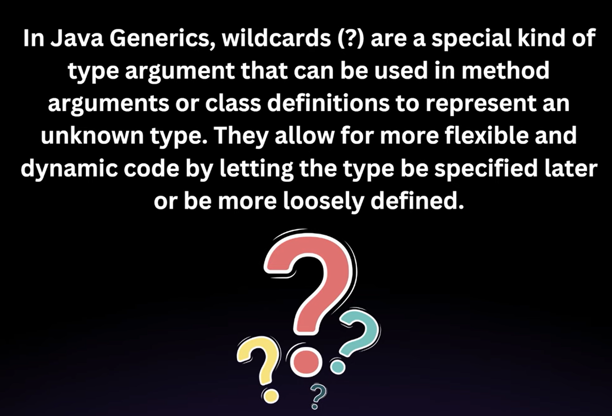
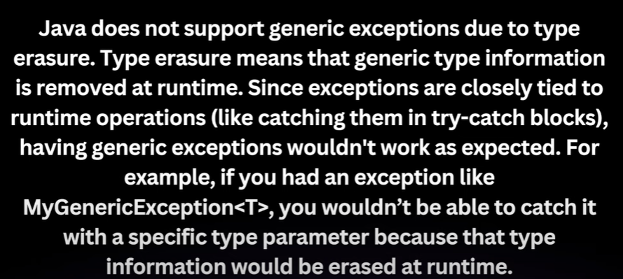

## Generic types allows you to define a class, interface or method with placeholders ( type Parameters ) for the data type they will work with

**Naming Convension**  

        T: Type
        E: Element ( Used in Collection )
        K: Key
        V: value
        N: Number

## **Bounded Type Parameters (`extends` and `&`)**

We can put `condition on the types` of `Placeholder of the Generic Class`

Example 1

        e.g-

            public class GenericContainer<T extends Number> {
                private T value;

                public T getValue() { return this.value;}

                public void setVaalue(T value) {this.value = value;}
            }

            the above placeholder T excepts the only the wrapper class which only extends Number wrapper class.

Example 2

        e.g-

        interface Printable {
            void print();
        }

        public class MyNumber extends Number implements Printable {

        }

        Public class Box<T extends Number & Printable> {

        }

        The above class states that the T can have the value which extends the Number or Implements Printable Interface.

        so it can take wrapper class which can extends the wrapper class Number ( like Integer, Float, Long etc...) or Implements the Printable class like ( MyNumber class described in the above code)

**Generic Constuctor**

        public class Box {

            public <T extends Number> Box {
                // Implementation
            } 

        }

**Generic Method**

        public class Test{

            public static void main(String[] args) {

            }

            public <T extends iterable> void printArray(T[] array) {

                for (T element : array) {
                    System. out. print(etement + " ");
                }
                System.out.println();

            }
        }

**Enums Generic Method**

        enum Operator {
            ADD, SUBSTRACT, MULTIPLY, DIVIDE;

            public <T extends Number> double apply(T a, T b) {
                switch (this) {
                    case ADD:
                        return a.doubleValue() + b.doubleValue();

                    case SUBSTRACT:
                        return a.doubleValue() - b.doubleValue();

                    case MULTIPLY:
                        return a.doubleValue() * b.doubleValue();

                    case DIVIDE:
                        return a.doubleValue() / b.doubleValue();
                    default:
                        throw new AssertionError("Unknown       Operation: " + this);
                }
            }
        }

        public class Test {
            public static void main(String[] args) {
                double result = Operator.ADD.apply(10, 11);
                System.out.println(result);
            }
        }

## *WildCards In generics (`?`)*

    import java.util.ArrayList;
    import java.util.List;

    public class Main {

        public static void main(String[] args) {
            System.out.println(sum(Arrays.asList(1, 2.2, 22)));

            // If we define the super class we define the lower limit of the function, Now we can add the add and access the value at the same time.
            List<? super Integer> numbers = Arrays.asList(1, 2, 3);

            numbers.add(12);
        }

        public static double sum( List<? extends Number> number ) {

            // Case 1 - Upper Bound
            double sum = 0;

            for( Number o: number ){
                sum += o.doubleValue();
            }

            return sum;
        }

        public static void printNumber( List<? super Integer> list) {

            // Case 2 - Lower Bound
            for( Object obj: list) {
                System.out.println(obj);
            }
        }
    }

## *Type Erasure*

Type erasure is a process the Java compiler uses to implement generics. During compilation, the compiler removes type parameters and replaces them with their bounds or Object if unbounded. This ensures backward compatibility with older Java versions and avoids runtime overhead from generics. However, it also means that type information is not available at runtime.

        The compiler performs the following actions during type erasure: 

        1. Replaces type parameters:
            All type parameters in generic types are replaced with their bounds, or with Object if they are unbounded. 
            For example, List<T> becomes List, and List<T extends Number> becomes List<Number>

        2. Inserts type casts:
            If necessary, the compiler inserts type casts to preserve type safety. 
            For instance, when retrieving an element from a generic list, a cast might be added to ensure the correct type.

        3. Generates bridge methods:
            To maintain polymorphism in extended generic types, the compiler generates bridge methods. 
            These methods ensure that subtype relationships work as expected after type erasure.

## *Generics Exceptions*

An exception is an event that occurs during the execution of a program that disrupts it's Normal flow.

